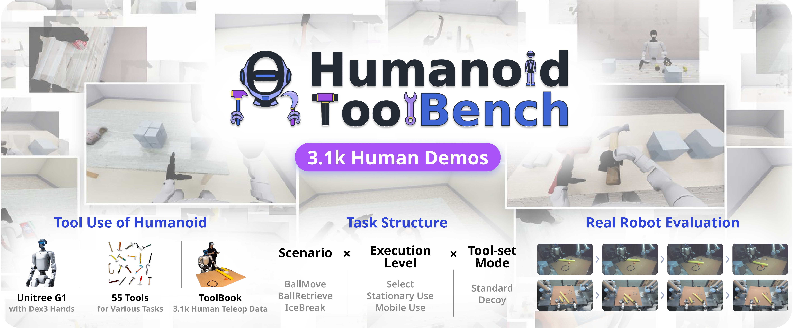

# HumanoidToolBench

[English](README.md) | [中文](README.zh-CN.md) | [한국어](README.ko.md)

HumanoidToolBench 评测 Unitree G1 能否选择合适的工具并用它完成任务。三个场景（BallMove、BallRetrieve、IceBreak）、三个级别（L0 工具选择、L1 原地使用、L2 移动使用）和两种工具集合模式（S、R）构成 **18 个条件**，在 MuJoCo 中用全身控制器进行仿真。本仓库是评测工具包：它通过 HTTP 调用你的策略，为每个回合打分，并校验录像。

文档：[环境说明](docs/ENVIRONMENTS.md) · [评测与策略接口](docs/PUBLIC_EVALUATION.md) · [数据集](data/README.md)

## 系统要求

- Linux x86_64，配备 NVIDIA GPU 和支持 EGL 无头渲染的驱动。锁定的 PyTorch wheel 为 CUDA 12.8 版本。无 GPU 的冒烟测试可使用软件渲染模式，见[评测指南](docs/PUBLIC_EVALUATION.md#installation-scope)。
- [uv](https://docs.astral.sh/uv/)、Git 和 `zstd`。Python 3.10 由 uv 自动安装。
- 安装约下载 4 GB，占用磁盘约 9 GB。首次运行 `--model` 时会再下载约 2 GB（检查点和 CLIP 文本编码器）。
- 单个条件按标准 100 回合运行，在一块 GPU 上约需 2 小时，产生约 1 GB 的视频和日志。全部 18 个条件顺序运行约需一天半，占用约 15 GB。以上数字使用随附的 ACT 检查点在一台工作站的 GPU 上测得，随策略推理时间增加。

## 快速开始

```bash
git clone https://github.com/SNU-PI/HumanoidToolBench.git
cd HumanoidToolBench
uv run --no-project scripts/setup_evaluation.py
```

安装命令会创建锁定的 Python 环境，按固定版本拉取控制器仓库，下载基准网格资源并运行自检。加上 `--check` 可检查已有安装。

先在默认条件 `G1BallMove-L0-S` 上用一次简短的诊断运行确认仿真、推理和录像正常（模型加载后仿真用时远少于一分钟，不是基准得分）：

```bash
uv run htb-eval --model snupilab/humanoidtoolbench-act-sim-3003 --episodes 1 --max-steps 100
```

然后运行标准协议（100 回合，随机种子 10000 至 10099，每回合最多 3000 步）。第一个参数选择条件，下例为带易混淆工具（R）的 BallRetrieve L1；`all` 运行全部 18 个条件：

```bash
uv run htb-eval G1BallRetrieve-L1-R --model snupilab/humanoidtoolbench-act-sim-3003
uv run htb-eval all --model snupilab/humanoidtoolbench-act-sim-3003
```

每个条件会写入 `data/evals/<condition>/run-<id>/benchmark_result.json`，包含成功次数，并保存每回合四路相机视频。诊断设置得到的结果为 `reportable: false`。`all` 还会写入 `data/evals/summary.json`，并在某个条件失败时继续运行其余条件。再次运行同一命令时，已由相同策略、代码、资源和运行环境得到验证结果的条件会被跳过。`--list-envs` 打印条件 ID 列表，`--dry-run` 只打印环境和回合设置而不运行。在多块 GPU 上分配条件的方法见[并行运行条件](docs/PUBLIC_EVALUATION.md#running-conditions-in-parallel)。

`--model` 从 Hugging Face ID 或本地路径加载 **HumanoidToolBench ACT 和 Diffusion Policy 仿真检查点**，例如 `snupilab/humanoidtoolbench-act-sim-3003` 和 `snupilab/humanoidtoolbench-dp-sim-3003`。其他模型通过 `--policy` 或下面的策略服务器进行评测。

### 参考结果

| 策略 | 条件 | 成功 |
| --- | --- | --- |
| `snupilab/humanoidtoolbench-act-sim-3003` | `G1BallMove-L0-S` | 2 / 100 |
| 未经训练、随机初始化的 ACT | `G1BallMove-L0-S` | 0 / 100 |

两行都使用标准协议和本版本附带的资源清单（`assets.manifest_sha256` 以 `3f5b21bf` 开头）。ACT 一行使用 SHA-256 以 `1e6459cb` 开头的权重（发布于模型版本 `ffd733de`），用时约 100 分钟。第二行使用已发布的 ACT 配置和重新初始化的权重（SHA-256 以 `66788a3b` 开头，未发布）。随附的 ACT 检查点是接近下限的参考点，而不是强基线，因此新策略得分低本身并不说明安装有问题。上面的单回合诊断运行预期输出 0/1。DP 检查点和其他条件尚未测量。

## 基准简介



**HumanoidToolBench: Benchmarking Humanoid Tool Use from Selection to Mobile Execution** 介绍了该基准、55 个工具资源以及包含仿真和真实机器人示范的 ToolBook 数据集。本版本只包含标准环境，不包含用于训练的简化变体。

## 评测你自己的策略

在仓库根目录编写 `my_policy.py`，加载一次模型并提供 `predict(request)`：

```python
import numpy as np

def predict(request: dict) -> np.ndarray:
    image = request["image"]["rgb_head_stereo_left"]   # (360, 640, 3) uint8 RGB
    state = request["state"]["states"]                 # (1, 32) float32
    instruction = request["instruction"]               # 例如 "Pick the tool and move the ball to the target."
    if request["history"].get("reset", False):         # 回合的第一次查询
        pass                                            # 在此清除循环状态
    actions = ...                                       # 你的模型
    return np.asarray(actions, dtype=np.float32)        # (T, 36)，每行一条 50 Hz 指令
```

如果你的模型依赖可以用 `uv pip install` 安装到本环境中，且不改变 `uv.lock` 中锁定的任何版本（例如 torch、numpy 和 transformers），一条命令即可评测：

```bash
uv run htb-eval G1BallMove-L0-S --policy my_policy:predict --checkpoint MODEL_ID_OR_REVISION --episodes 1 --max-steps 100
```

否则在一个终端中，于仓库根目录用你自己的模型环境（Python 3.10 或更高版本，并安装 NumPy 和 requests）启动服务器，并在另一个终端运行评测器：

```bash
PYTHONPATH=src python examples/serve_policy.py --policy my_policy:predict --checkpoint MODEL_ID_OR_REVISION
uv run htb-eval G1BallMove-L0-S --host 127.0.0.1 --port 21000 --episodes 1 --max-steps 100
```

`--episodes` 和 `--max-steps` 的默认值就是标准协议，因此去掉这两个选项即可进行可报告的 100 回合运行。服务器运行在另一台机器上时，用 `--host 0.0.0.0` 启动服务器，并把它的地址传给评测器的 `--host`。每个评测器使用一个独立的服务器；服务器在一个评测器使用期间会拒绝第二个评测器。32 维状态、带关节名称和限位的 36 维动作、图像和 reset 语义见[策略接口](docs/PUBLIC_EVALUATION.md#policy-interface)。

## 条件

| 场景 | 正确工具 | L0 | L1 | L2 |
| --- | --- | --- | --- | --- |
| BallMove | 长杆 | 拿起工具 | 把球推进圆环 | 同上，先沿工作台移动 |
| BallRetrieve | 钩子 | 拿起工具 | 把球拉进圆环 | 同上，先沿工作台移动 |
| IceBreak | 金属锤 | 拿起工具 | 敲碎两块冰 | 同上，先沿工作台移动 |

模式 **S** 把正确工具与两个无关物体放在一起；模式 **R** 再加入一个易混淆工具（短杆、直杆，或苍蝇拍、油漆滚筒、马桶搋子这类轻而柔软的干扰工具）。成功状态需保持一秒；L0 要求把正确工具抬起 8 cm。指令、阈值和记录的指标见 [docs/ENVIRONMENTS.md](docs/ENVIRONMENTS.md)。

## 数据与训练

**[在 Hugging Face 下载 ToolBook](https://huggingface.co/datasets/snupilab/humanoidtoolbench-teleop)**

目前下载录制数据需要申请并获得访问许可。目录结构和观测/动作格式见[数据指南](data/README.md)。

本版本提供**评测代码**。你可以使用示范数据在自己的框架中训练模型；本版本不包含模型训练流程。

[MIT 代码许可证](LICENSE)。第三方资源、模型和数据遵循各自的条款。
